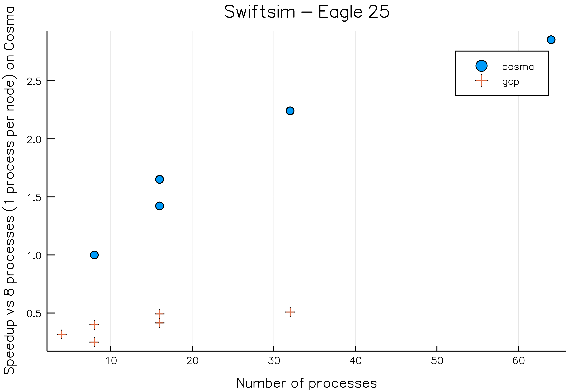

# Cloud with multi-node communication

The objective is to test the viability and performance of running multi-node jobs "on the cloud".
Two cosmology software implementing MPI algorithms were initially selected for benchmarking, Gadget
and Swift. Due to the restrictions in those software - namely the constraints on the number of
processors for the given inputs - another software was added to the mix, Nektar++, a high-order
polynomial base finite-element method.

"On the cloud" is a fairly unspecific expression, especially when it come to multi-node jobs. In
practice, it could signify a number of different workflows for the end-user. For instance, it could
mean the user, through a command-line or GUI interface, specifies the software they are running  as
well as initial location of the input files and the final location of the output files. Or it could
mean that the user logs on to a server and carries their business much as they do on any other HPC
resource. The latter presents no advantage to the user compared to current practices. The former
presents a new workflow which could potentially greatly improve the reproducibility of computational
research while simultaneously abstracting platform details from the user. The first of these
possibilities was explored through [batch-shipyard](https://github.com/Azure/batch-shipyard) offered
by Azure. The second possibility was explored via templates for Azure and the Google cloud platform.

## A new cloud work-flow

From an RSE point of view, the cloud promises a more reproducible workflow for HPC users.
Technologies like docker can make building software vastly more reproducible by abstracting away the
operating system of the HPC infrastructure. In conjunction with cloud storage and sensible user
interfaces, it could make computational research as whole more reproducible, by establishing
explicit links between source code/docker containers, input files and output files.  It also
promises to abstract away the underlying HPC resources, making it possible for users to run the same
HPC workflow on a variety of hardware with a variety of providers.

Unfortunately, the anecdotal evidence in this report suggest this still remains a promise and will
remain for a while yet without heavy investment from all stakeholders.

There was only time to test this approach via
[batch-shipyard](https://github.com/Azure/batch-shipyard). Initially, it seemed like a good fit: it
specifies the underlying hardware, docker container, and jobs using a set of yaml files. However, it
is quite difficult to work with. It requires a fair number of separate accounts, e.g. for storage,
for  permissions, for groups, etc. Some of these accounts are specified via names, and others via
long hashes that can be obtained deep inside the Azure portal. In practice, the job of tying
together Azure's is left as an exercise to the user. The yaml format itself is quite slap-dash:
sometimes a key requires a values, and sometimes a key is the value; but it is left to the user to
second guess when and where each convention is meant to be used. After several weeks of effort, it
was not possible to run a docker container with a functioning mpi job (using a simple mpi4py
script). More specifically, the job would freeze when trying to communicate between nodes.  It is
not clear whether some permission on Azure where not set correctly, or whether the container was not
crafted to fit the azure cloud resources. The example containers given by Azure are built either on
top containers for which the Dockerfile is not available, and hence irreproducible, or use intel
mpi, for which a license was not available at the time.

Taking into account the current state of the infrastructure in Azure, it is clear this approach
would require very large initial and recurrent efforts from a dedicated IT team specifically trained
to deal with Azure idiosyncrasies.

We note that batch-shipyard is not the only solution on Azure for this approach. Some that we have not explored include [batch-mpi](https://docs.microsoft.com/en-us/azure/batch/batch-mpi) which has been used  to run OpenFOAM MPI as shown in this [blog post](https://blogs.technet.microsoft.com/windowshpc/2016/07/20/introducing-mpi-support-for-linux-on-azure-batch/), or directly [provisioning VMs using the command-line tools](https://docs.microsoft.com/en-us/azure/virtual-machines/linux/classic/rdma-cluster).

## Transparent cloud work-flow

The other option is for an IT team to recreate the standard HPC approach, but using a cloud
provider. This approach is transparent to the user: by design, the user will interact with the cloud
offering exactly as though an existing HPC resource. If there are any advantages to this approach,
they are exclusively for the teams managing HPCs. Users and RSEs will not know the difference.

Once again, there are many ways to accomplish this. [Cycle
Cloud](https://cyclecomputing.com/products-solutions/cyclecloud/) is one commercial offering
recently acquire by Microsoft. There are also templates available from Microsoft with the explicit
purpose of creating a slurm cluster. Similar templates also exist for the Google cloud platform.

It is possible to contrast the two providers. In both cases, one or more text
files describe the cluster fully, including the machines, the network, and the
storage options. In both cases, the initial provisioning is done via an initial
start-up script. The google cloud platform is quite straightforward to use.
Permissions and accounts are initialized once and managed by the command-line
tools. The underlying template is a single straightforward yaml files with some
additional standard Jinja templating. Many of the parameters indicate the
underlying API is RESTfull. For instance, the type of the nodes, including
number of processors and amount of ram, can be parameterized simply by changing
the endpoint of the RESTful interface. The example template for an elastic
slurm cluster do work from the get go. On the other Azure uses a bespoke
instrumented json format that is quite baroque, verbose, and difficult to read.
The [examples](https://github.com/bhummerstone/5clickTemplates.git) provided us
where quite helpful in getting started. However, they were mostly all broken in
simple or less simple ways, e.g. broken links to external resources such as
ez_build, opr hard-coded values where variables where meant in the slurm
template files. One of the difficulties resides in that the startup script must
be stored on the cloud, rather than locally on the computer from which the
cloud resource is being created. This difficulty epitomizes the unnecessary
faff and baroqueness that characterizes every Azure tool that I have used. It
was eventually possible to create a slurm cluster with a _static_ number of
nodes and launch simple MPI jobs on it. Certainly, both platforms offer more
or less the same capabilities. But the amount of faff that comes with Azure
tools is enormous. It is not clear whether these are the mark of an immature
set of products with only vague links between them, or whether selling
certified training for specialist IT personnel is part of the business model. 

Because of time constraints, and because the Cycle Cloud approach (attempted by
another RSE) was more likely to yield a working infiniband network, the Azure
cluster template was not tested beyond running a simple mpi example script.
Most of the testing was carried on the google cloud platform.

## Gadget

Gadget is an N-body/smooth particle hydrodynamics cosmology code. It uses fairly old tools; it
relies on hand-curated makefiles for compilation. It uses MPI-1 for communication. It requires a
fair amount of input. Unfortunately, the input we were given to benchmark could not run below 128
processors because of the way the IO is setup. Furthermore, it was not possible to run it on
anything but 512 processors on Cosma because of memory issues. Finally, although the code was
compiled on the google cloud platform, it failed to run. It complained of memory issues, though that
seemed unlikely to be the problem since it was running on nodes 32 with 16 process each and 900Gb of
memory. In view of the time constraints, and noting that this old code uses non-portable
hand-curated makefile, I did not investigate further.

## Swiftsim

Swiftsim is another smooth particle hydrodynamics cosmology code. Somewhat more modern than Gadget,
it relies on the gnu autotools for building. It also seems to rely mostly on the MPI-1 standard. For
the purpose of this project, the recipe in the [Spack](https://Spack.io) package manager was updated
to the latest Swiftsim version. Spack makes it simple to provision a cloud cluster with Swiftsim and
all its dependencies. At time of writing, the pull-request has been accepted
into the main Spack repo.

Swiftsim was run on Cosma and on the google cloud platform, with 8 processors. The main issue I
encountered was the amount of memory it requires. Eventually, the ultramem nodes that came online
during the project did the trick.

Below, we show the speedup achieved for swift on the Eagle 25 benchmark. The
reference value is the time taken to run the benchmark on Cosma with 8
processes, 16 threads per process, and 1 process per node. The same version of
the code is used in both cases. However, the code on Cosma is compiled with the
intel compiler and MPI suite, whereas is compiled with gcc and mpich on the
google compute platform. In all cases, we ran 16 threads per processes. To try
and test the network speed and latency, we run different configurations of
nodes and processes per node.  It is notable that the GCP results are much
slower.  It could be the result of the diffence in compilers and hardware
network.  Indeed, running 4 nodes and 2 processes per node is much slower than
running 8 nodes and 1 process per node. However, there is anecdotal evidence
that another issue could be behind the slowdown, namely network disk access.
When running several benchmark simultaneously, the head on node became quite
sluggish, even though no compute was being performed there. The network drive
uses NFS. A more thorough series of tests with a Luster filesystem is waranted
before dismissing the Google Cloud Platform completely. Indeed, it may be a
sign that a cloud approach less slavish to reproducing the old HPC workflow is
warranted.

## Nektar++

Nektar++ is a higher order finite element method. It is written in C++, and is built with CMake. It
can make use MPI-IO when compiled with HDF5 support. More importantly, examples are provided where
we can vary the number of processes and compute strong scaling graphs. For the purpose of this
project, a recipe was added to Spack to facilitate installation on the cloud
platforms. At time of writing, the pull-request is still under discussion in
the main repo.

Two types of runs with different communication characteristics are used. A simulation of the
electrophysiology of the heart is carried out. This is a 2d-surface with reduced communication
requirements. A more demanding 2.5d calculation of the flow across a laterally-extended
cross-section of a wing is also carried out. The lateral direction is performed via FFTs, whereas
the cross-section plane is modeled with finite elements.

The two benchmark are run on the GCP and on Cosma. Several runs are performed for each benchmark, varying only the platform (GCP or Cosma), the number of nodes, and the number of processes per node. Below, we plot strong scaling speedup for each benchmark. The speedup is computed as the ratio of the average time per simulation step (excluding the first, which contains setup) for a single process job on Cosma vs the average time per step for a given job. These are *strong* scaling plots.

The results of two benchmarks are diametrically opposed. In the case of the 2-d surface (Cardiac electro-physiology) with smaller communication requirements, we find that Nektar scales near linearly on both platforms. However, the GCP is substantially faster, with an approximate ratio of 1.4. This is not unexpected since the machine types are Broadwell on GCP, and Sandy Bridge on Cosma.
However, in the case of the wing cross-section benchmark, we find that the scaling is no longer linear, and that Cosma performs better. Since this benchmarks incorporates fast-Fourier transforms, it is expected the scaling should be no longer linear. We note that, surprisingly, the GCP is slower than Cosma for a single process by a factor 0.95, even though the underlying machine is supposedly faster. There are several explanations for this behavior, including differences in available memory, access to the network drives, etc... Furthermore, at 128 processes, the ratio has decreased to 0.65, indicating that the cost of communication increases faster on the GCP than on Cosma.

Where possible we run several configurations for the same number of processes, with different number of nodes and different number of processes per node. The hope is that the differences between the configuration are a measure of the cost of emitting internode messages vs intra-node messages, for the same communication pattern. However, there are two caveats, namely jitters between one run and the next, as well as hardware abstraction on the cloud. Indeed, when requesting two virtual machines on the cloud, it is not a given that they sit on different underlying hardware, or on different racks, or even in different data centers. Only at higher node counts can we be reasonably sure that the VMs sit on different actual machines. A more thorough study would be required to fully distinguish between jitter and communication costs. However, it does seem that differences between configurations are small in the cardiac electro-physiology benchmark for both platforms, as expected for benchmark where compute costs dominate. And it the differences are much more pronounced for the wing cross-section benchmark where communication costs are more important. I would not conclude on differences between platforms from this data.
